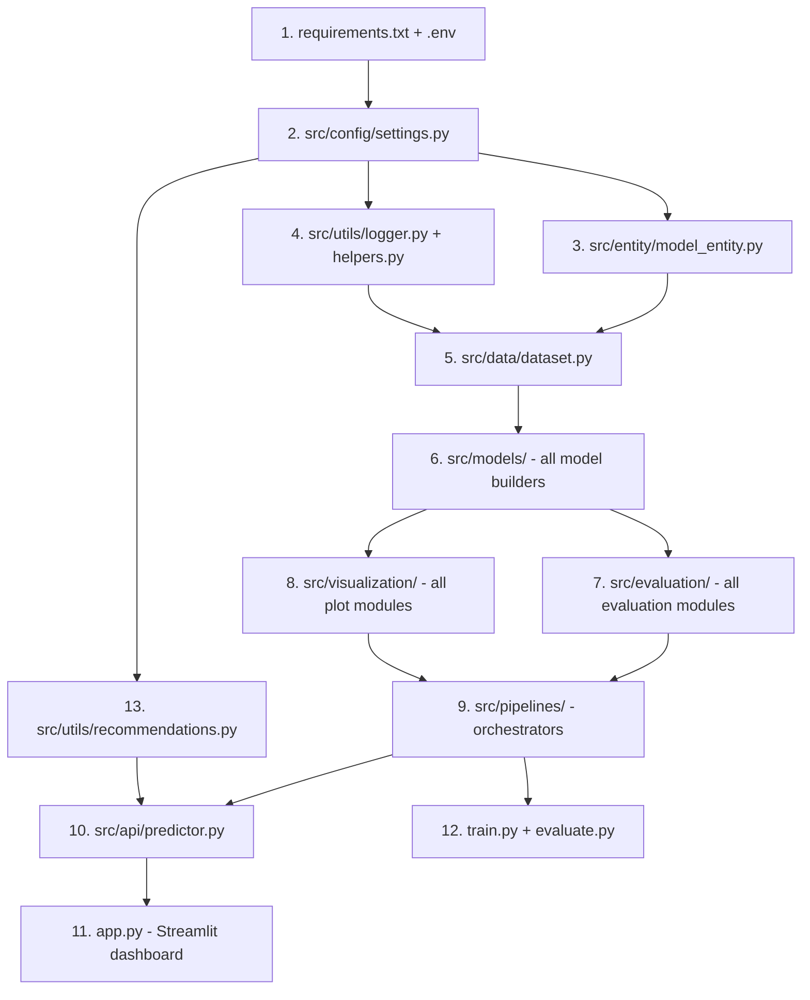

# Explainable Multi-Model Deep Learning Framework for Plant Disease Detection

## Background & Context

You already have a working foundation:
- **PlantVillage dataset** with 15 classes (3 plants × 5 disease categories each), ~20,639 total images
- **Existing single-model** (MobileNetV2) training script and Streamlit app ("AGRI-X AI")
- **Python 3.13.11** with TensorFlow 2.21.0, Keras 3.13.2, scikit-learn, Streamlit 1.55 installed

This plan restructures everything into a professional, research-grade, modular ML project.

---

## User Review Required

> [!IMPORTANT]
> **Training Time:** Training 4-5 models with fine-tuning + 5-fold CV + hyperparameter tuning will take **many hours** on CPU (potentially 24-48+ hours total). Do you have GPU access? If not, I'll set conservative epoch counts (5-10 epochs for initial runs) with easy config to scale up later.

> [!IMPORTANT]
> **ViT Model:** The Vision Transformer (ViT) requires the `vit-keras` or `transformers` package. Python 3.13 may have compatibility issues with some ViT libraries. I'll include it as optional and use a keras-compatible implementation.

> [!WARNING]
> **Existing Code:** The new project structure will live inside `AI_Farming_Project/` as a clean restructure. Your existing files (`train_model.py`, `app.py`, `plant_disease_model.h5`) will NOT be deleted but the new code will be self-contained in the new structure.

---

## Open Questions

> [!IMPORTANT]
> **Disease Severity Labels:** PlantVillage does NOT have severity labels (mild/moderate/severe). For the severity detection module, I'll implement a **heuristic approach** based on Grad-CAM activation area percentage + confidence thresholds. This is a reasonable research approach. Is that acceptable, or do you want me to skip this feature?

> [!IMPORTANT]
> **Keras Tuner Compatibility:** On Python 3.13, `keras-tuner` may have limited support. I'll include it but provide a fallback manual grid search if installation fails.

---

## Proposed Changes

The project creates **~25 Python modules** organized in a clean architecture. Here's the complete plan:

---

### Project Scaffold

#### [NEW] requirements.txt
All dependencies: tensorflow, keras-tuner, scikit-learn, matplotlib, seaborn, streamlit, opencv-python, grad-cam, pandas, scipy, etc.

#### [NEW] .env
Configuration: dataset path, image size, batch size, epochs, model names, output paths.

#### [NEW] README.md
Research-grade documentation with project overview, architecture diagram, setup instructions, usage guide, results summary.

---

### Configuration Layer (`src/config/`)

#### [NEW] src/config/__init__.py
#### [NEW] src/config/settings.py
Central configuration dataclass with ALL hyperparameters, paths, model configs, augmentation params. Single source of truth for the entire project.

---

### Entity Layer (`src/entity/`)

#### [NEW] src/entity/__init__.py
#### [NEW] src/entity/model_entity.py
Data classes for `TrainingResult`, `EvaluationResult`, `ModelMetrics`, `AblationResult`, `CrossValidationResult`.

---

### Data Layer (`src/data/`)

#### [NEW] src/data/__init__.py
#### [NEW] src/data/dataset.py
- `DatasetManager` class
- Load PlantVillage dataset using `tf.keras.utils.image_dataset_from_directory`
- Train/val/test split (70/15/15)
- Consistent preprocessing pipeline (resize 224×224, normalize to [0,1])
- Data augmentation layer (rotation, flip, zoom, brightness, shift)
- Class weight computation for imbalanced classes
- Dataset statistics and distribution analysis

---

### Models Layer (`src/models/`)

#### [NEW] src/models/__init__.py
#### [NEW] src/models/base_model.py
- `BaseModelBuilder` abstract class
- Common transfer learning pipeline: load pretrained → freeze → add classifier head → compile
- Classifier head: GlobalAveragePooling2D → BatchNorm → Dense(256) → Dropout → Dense(128) → Dropout → Output

#### [NEW] src/models/mobilenet.py
MobileNetV2 builder (ImageNet weights, input 224×224×3)

#### [NEW] src/models/resnet.py
ResNet50 builder

#### [NEW] src/models/efficientnet.py
EfficientNetB0 builder

#### [NEW] src/models/densenet.py
DenseNet121 builder

#### [NEW] src/models/vit_model.py
Vision Transformer using `keras.applications` or custom implementation. Optional — graceful fallback if unavailable.

#### [NEW] src/models/model_factory.py
Factory pattern: `get_model(name: str) -> keras.Model`

---

### Evaluation Layer (`src/evaluation/`)

#### [NEW] src/evaluation/__init__.py
#### [NEW] src/evaluation/metrics.py
- Compute: accuracy, precision, recall, F1, AUC, per-class metrics
- Generate classification report
- Confusion matrix computation
- ROC curve data (one-vs-rest for multiclass)
- Precision-recall curve data
- Inference time measurement
- Model size measurement

#### [NEW] src/evaluation/cross_validation.py
- 5-fold cross validation implementation
- Per-fold metrics tracking
- Mean ± std computation across folds

#### [NEW] src/evaluation/statistical_analysis.py
- Mean, variance, std, confidence intervals (95%)
- Statistical comparison tables between models
- Paired t-test between model performances

#### [NEW] src/evaluation/ablation_study.py
- Run ablation experiments: base → +augmentation → +fine-tuning → +hyperparameter tuning
- Generate ablation comparison table

#### [NEW] src/evaluation/compression_study.py
- Model size analysis (parameter count, file size, FLOPs estimate)
- Inference speed benchmarking
- Accuracy vs size tradeoff analysis
- Deployment efficiency scoring

---

### Visualization Layer (`src/visualization/`)

#### [NEW] src/visualization/__init__.py
#### [NEW] src/visualization/training_plots.py
- Accuracy vs Epoch curves
- Loss vs Epoch curves
- Combined training history plots

#### [NEW] src/visualization/evaluation_plots.py
- Confusion matrix heatmaps (seaborn)
- ROC curves (per-class + macro)
- Precision-recall curves
- Model comparison bar charts
- Inference time comparison
- Model size comparison

#### [NEW] src/visualization/gradcam.py
- Grad-CAM implementation for any model
- Heatmap generation and overlay on original images
- Batch Grad-CAM for sample images per class
- Save outputs to `reports/gradcam/`

---

### Utilities (`src/utils/`)

#### [NEW] src/utils/__init__.py
#### [NEW] src/utils/logger.py
Professional logging setup with file + console handlers, timestamps, module names.

#### [NEW] src/utils/helpers.py
- Seed setting for reproducibility
- Timer context manager
- Directory creation utilities
- JSON/CSV export helpers

#### [NEW] src/utils/recommendations.py
- Rule-based recommendation engine
- Per-disease: pesticide, fungicide, irrigation, fertilizer recommendations
- Disease severity estimation from Grad-CAM activation percentage
- Structured recommendation output

---

### Pipelines Layer (`src/pipelines/`)

#### [NEW] src/pipelines/__init__.py
#### [NEW] src/pipelines/training_pipeline.py
Main orchestrator:
1. Load & preprocess data
2. For each model architecture:
   - Build model with transfer learning
   - Train Phase 1 (frozen base, ~5 epochs)
   - Train Phase 2 (fine-tuned, ~10-15 epochs)
   - Evaluate on test set
   - Generate all metrics & visualizations
   - Save model checkpoint
3. Generate comparison reports

#### [NEW] src/pipelines/evaluation_pipeline.py
Post-training evaluation orchestrator:
1. Load saved models
2. Run full evaluation suite
3. Cross-validation
4. Statistical analysis
5. Ablation study
6. Compression study
7. Generate all reports and graphs

#### [NEW] src/pipelines/hyperparameter_pipeline.py
Keras Tuner pipeline:
- Tune learning rate, dropout, dense units, optimizer
- Save tuning results
- Retrain best configuration

---

### API Layer (`src/api/`)

#### [NEW] src/api/__init__.py
#### [NEW] src/api/predictor.py
- `PlantDiseasePredictor` class
- Load any saved model
- Preprocess input image
- Return top-k predictions with confidences
- Generate Grad-CAM for prediction
- Estimate disease severity
- Generate recommendations

---

### Streamlit Dashboard

#### [NEW] app.py (overwrites existing)
Professional multi-page Streamlit dashboard with:

**Sidebar:**
- Model selection dropdown (all 4-5 models)
- Navigation between pages

**Pages/Sections:**
1. **🏠 Home** — Hero section, upload, predict
2. **🔍 Prediction** — Image upload → prediction → confidence → top-3 predictions → Grad-CAM overlay → severity estimate → recommendations
3. **📊 Model Comparison** — Interactive table + bar charts comparing all models
4. **📈 Training History** — Per-model accuracy/loss curves
5. **🎯 Evaluation** — Confusion matrices, ROC curves, PR curves
6. **🔬 Research** — Ablation study, cross-validation results, statistical analysis, compression study
7. **ℹ️ About** — Project info, methodology, references

**Design:**
- Dark/light theme toggle
- Custom CSS with glassmorphism cards
- Animated transitions
- Color-coded severity indicators
- Interactive Plotly charts where appropriate

---

### Reports Structure

#### [NEW] reports/ directory tree
```
reports/
├── graphs/           # All training & comparison plots
├── confusion_matrix/ # Per-model confusion matrices
├── roc_curves/       # Per-model ROC curves
├── metrics/          # CSV files with all metrics
├── gradcam/          # Grad-CAM visualizations
└── summary/          # Final comparison reports
```

---

### Entry Points

#### [NEW] train.py
CLI entry point for training pipeline. Parses args, runs training.

#### [NEW] evaluate.py
CLI entry point for evaluation pipeline. Loads saved models, runs all evaluations.

---

## Module Dependency Order (Build Sequence)



---

## Verification Plan

### Automated Tests
1. **Syntax check:** `python -c "import src"` — verify all modules import cleanly
2. **Config test:** Verify settings load correctly with default values
3. **Data pipeline test:** Load a small batch from PlantVillage, verify shapes (batch, 224, 224, 3)
4. **Model build test:** Build each model, verify output shape matches num_classes
5. **Quick training smoke test:** Train 1 model for 1 epoch, verify training completes without errors
6. **Evaluation test:** Run evaluation on dummy predictions, verify all metrics generate
7. **Visualization test:** Generate 1 of each plot type, verify files saved
8. **Streamlit test:** `streamlit run app.py` — verify dashboard loads without errors

### Manual Verification
- Full training run (user-initiated, as it takes hours)
- Visual inspection of Streamlit dashboard
- Review generated reports and graphs

---

## Estimated File Count & Scope

| Component | Files | Approx Lines |
|-----------|-------|--------------|
| Config & Entity | 4 | ~300 |
| Data | 2 | ~250 |
| Models | 7 | ~400 |
| Evaluation | 5 | ~600 |
| Visualization | 3 | ~500 |
| Pipelines | 3 | ~500 |
| Utils | 3 | ~350 |
| API | 2 | ~200 |
| Streamlit App | 1 | ~800 |
| Entry Points + Docs | 4 | ~300 |
| **Total** | **~34** | **~4,200** |

This is a substantial codebase. I'll build it methodically following the dependency order above.
